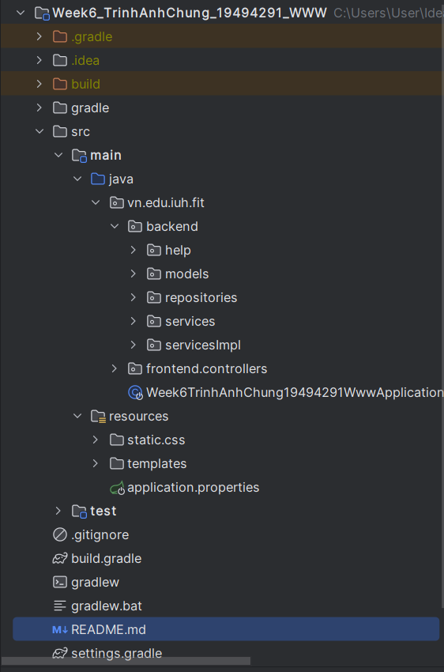
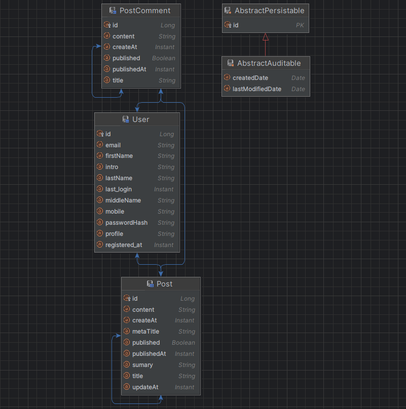
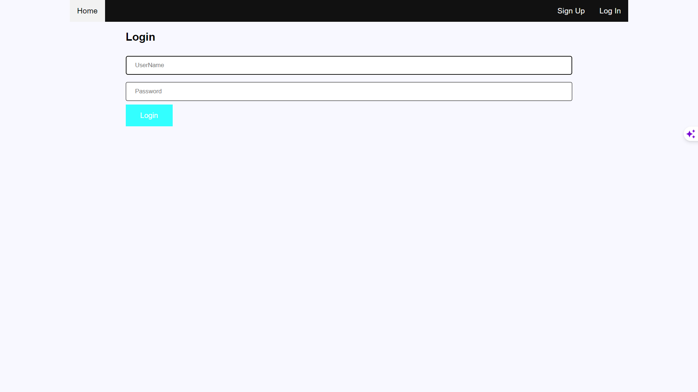
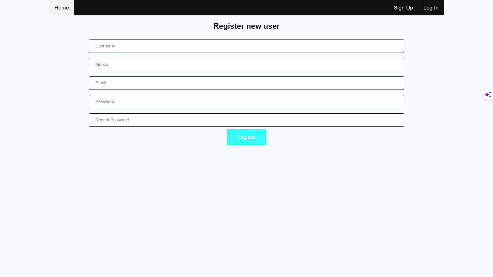
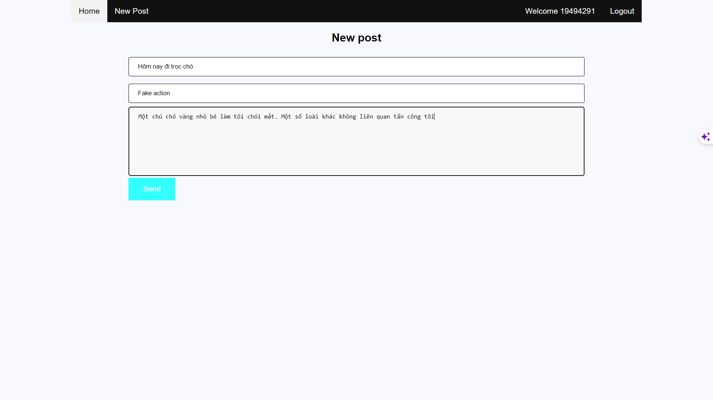
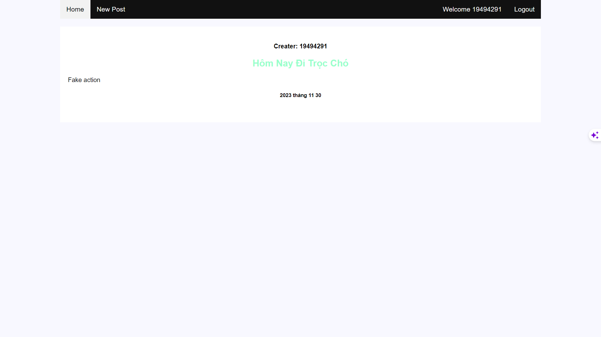
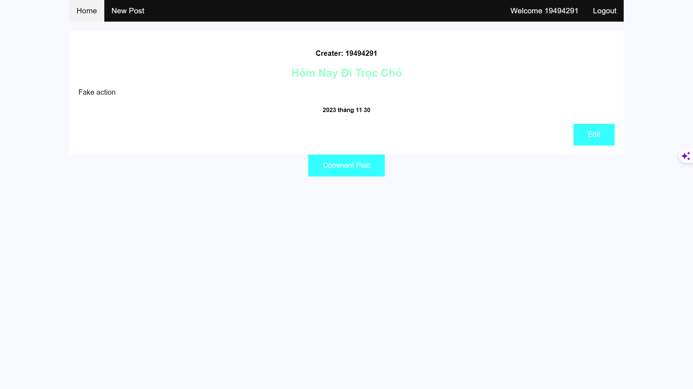
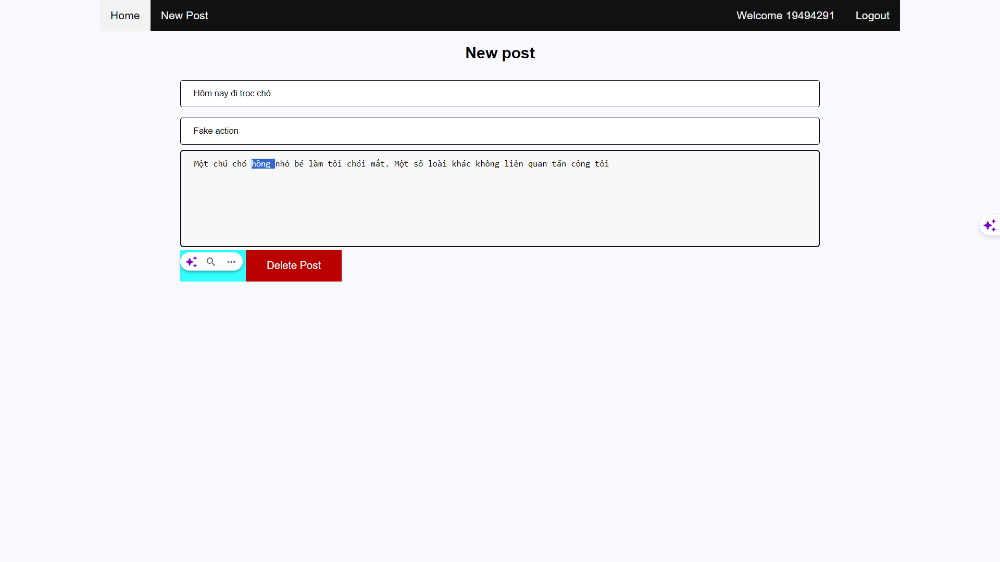
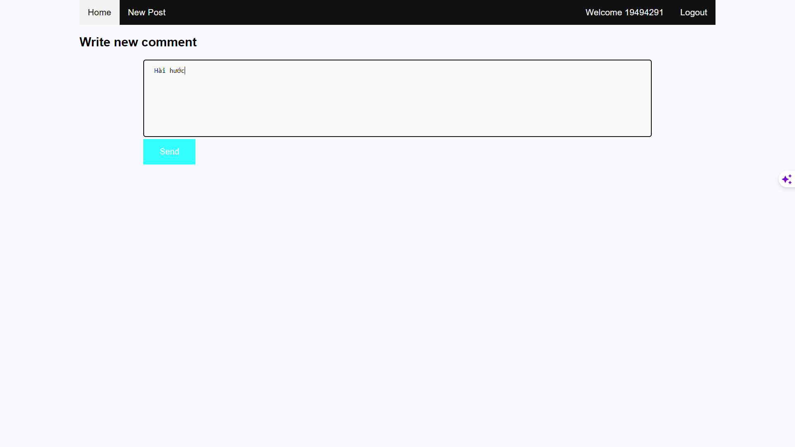

# Week6_TrinhAnhChung_19494291_WWW
### Information:
-Name: Trịnh Anh Chung
-Mssv: 19494291
### Description:
Request: Develop a blog website using Spring Boot.

## Project architecture
>
## Database
>
## Feature
Registration, Login
Utilize cookies, sessions
Post, edit, delete posts
Comment on posts, edit comments
Display a list of posts
## Feature: Login
>
## Feature: Registration
>
## Feature: Post
>
>
## Feature: Post, edit, delete
>
> 
## Feature: Comment on posts
>
## The tools that have been used
-IDE: IntelliJ
-Framework: Spring Boot
-Web server: Tomcat
-Database server: MySQL
-Code storage: GitHub
